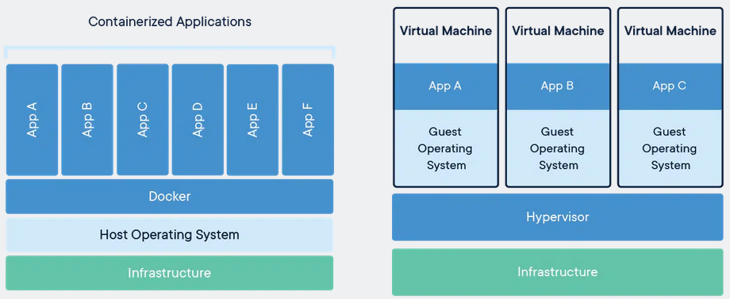
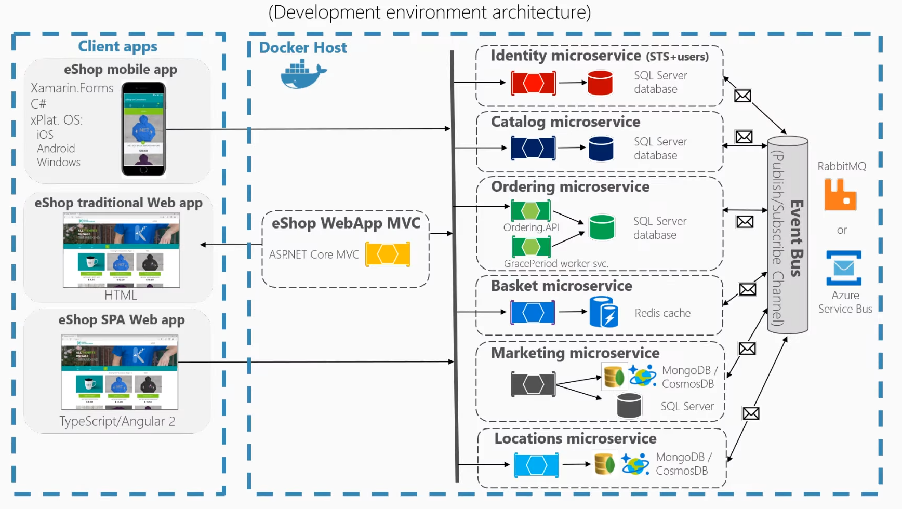

# Docker

Контейнеры - это как виртуальные машины только без `OC`

Другими словами, вместо того, чтобы каждой виртуальной машине ставить свою `OC` разработчики контейнера сказали - давай, использовать ту операционную систему которая используется в физ. компьютер

Использовать OC внутри хоста

В чем недостаток докера, есть зависимость от OC хоста

У нас в любом контейнере есть два типа файлов приложений и dll и общие библиотеки, это может быть Java, .NET, Python, это общие dll, это общие файлы.

Доустим есть функция которая проверяет связь с серверами, чтобы не писать везде этот код и используется эта dll'ка в разных приложениях.

И внутри конейнера они всегда идут с ним.

Контейнер никогда не сможет обратиться к файлам в физическом мире

И этим он отличается от портативных приложений.

--------------------
Что такое докер и почему контейнеризация стала популярной

Docker - это средство виртуализации на уровне операционной системы, или 
иными словами средство контейнеризации - это синонимы. 

Данное средство позволяет иметь несколько пространств пользователей, т.е контейнеров на одной `хост` машине

Каждый контейнер имеет собственный ip адресс локальной под сети и независимый набор программного обеспечения.

По своему функционалу контейнер схож с виртуальной машиной.

Докер не единственное средство контейнеризации, есть и аналого

    OpenVZ
    Virtuozzo
    LXC
    SOLARIS
    BSD

Каждый из них имеет свою нишу, и активно применяется, в основном, они появились раньше, на заре своего существования докер использовал `API LXC` linux containers.

При этом среда выволнения `Docker` не являеться каноническим стандартом для аркистрации, т.е использование контейнеров в боевых условиях и широко применяется в разработке и в деплое, с докер началась тендеция на микросервисную архитекткру, и появилась профессия `DevOps`.

- Докер впринципе изменил подход к разработке т.к контейнеризация стала прежде всего удобной и быстрой, ориентированной на пользователя любого уровня, и специализации.

- Докер разработал клиент - который позволяет управлять контейнерами с помощью простых cli команд

- У докера есть собственный публичный репозиторий `Docker Hub`, работа с которым настроена из коробки и возможна анонимно.

- Кроссплатфоменность