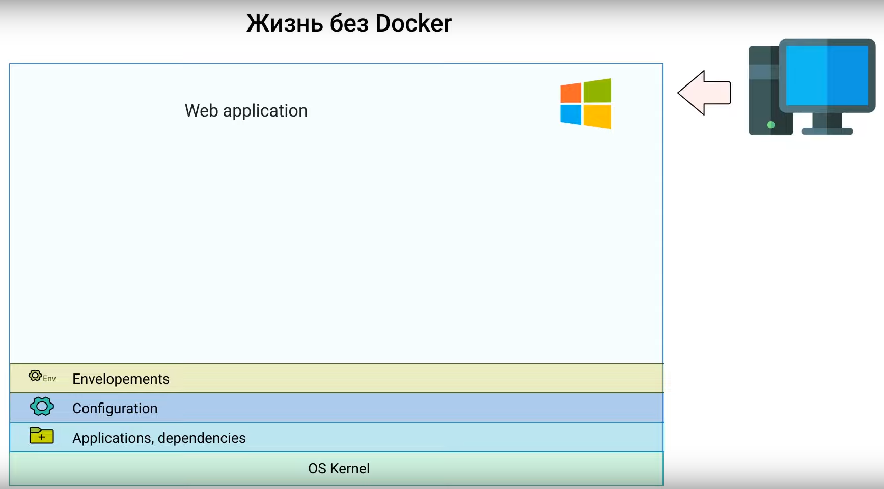
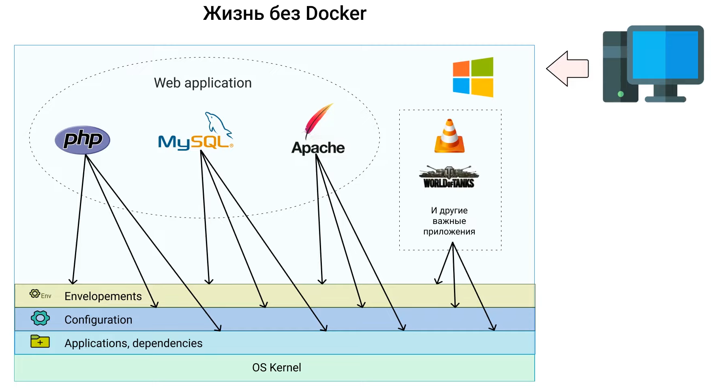
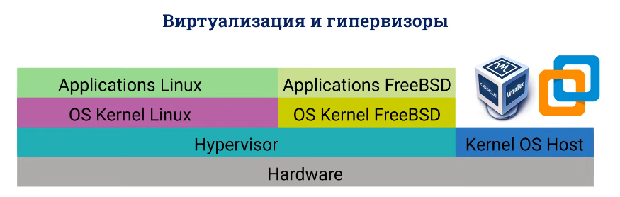
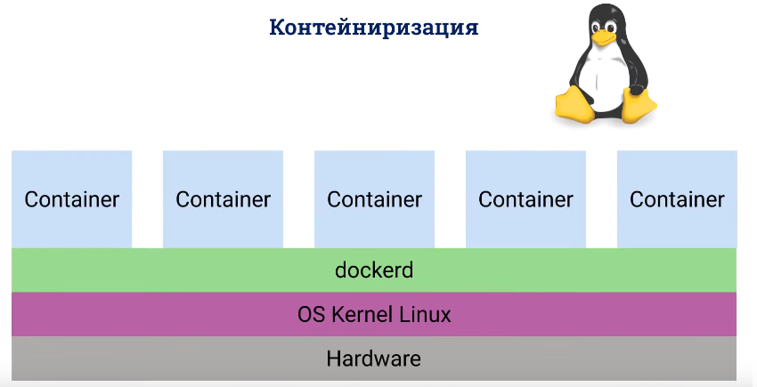

# Docker

Контейнеры - это как виртуальные машины только без `OC`

Другими словами, вместо того, чтобы каждой виртуальной машине ставить свою `OC` разработчики контейнера сказали - давай, использовать ту операционную систему которая используется в физ. компьютер

Использовать OC внутри хоста

В чем недостаток докера, есть зависимость от OC хоста

У нас в любом контейнере есть два типа файлов приложений и dll и общие библиотеки, это может быть Java, .NET, Python, это общие dll, это общие файлы.

Доустим есть функция которая проверяет связь с серверами, чтобы не писать везде этот код и используется эта dll'ка в разных приложениях.

И внутри конейнера они всегда идут с ним.

Контейнер никогда не сможет обратиться к файлам в физическом мире

И этим он отличается от портативных приложений.

--------------------
Что такое докер и почему контейнеризация стала популярной

Docker - это средство виртуализации на уровне операционной системы, или 
иными словами средство контейнеризации - это синонимы. 

Данное средство позволяет иметь несколько пространств пользователей, т.е контейнеров на одной `хост` машине

Каждый контейнер имеет собственный ip адресс локальной под сети и независимый набор программного обеспечения.

По своему функционалу контейнер схож с виртуальной машиной.

Докер не единственное средство контейнеризации, есть и аналого

    OpenVZ
    Virtuozzo
    LXC
    SOLARIS
    BSD

Каждый из них имеет свою нишу, и активно применяется, в основном, они появились раньше, на заре своего существования докер использовал `API LXC` linux containers.

При этом среда выволнения `Docker` не являеться каноническим стандартом для аркистрации, т.е использование контейнеров в боевых условиях и широко применяется в разработке и в деплое, с докер началась тендеция на микросервисную архитекткру, и появилась профессия `DevOps`.

- Докер впринципе изменил подход к разработке т.к контейнеризация стала прежде всего удобной и быстрой, ориентированной на пользователя любого уровня, и специализации.

- Докер разработал клиент - который позволяет управлять контейнерами с помощью простых cli команд

- У докера есть собственный публичный репозиторий `Docker Hub`, работа с которым настроена из коробки и возможна анонимно.

- Кроссплатфоменность

Контейнеры, что было до них, и как докер изменил CI/CD на примере.

Контейнер - это приложение со всем необходимым в изолированной среде

    Файлы приложения
    Конфигурация
    Зависимости, все нужные библиотеки
    Переменные окружения
    Стартовый скрипт

Контейнеры портативны, ими можно легко поделиться!

Их можно легко шейрнуть, делается это не с контейнерами, а с образами.

Разработчики и СисАдмины могут работать с одной и той же копией контейнера.
Храняться они в специальных репозиториях, репозитории могут быть приватными и публичными. Под публичным обычно воспринимают DockerHub.

При этом контейнеры не требовательны к ресурсам, занимают немного места на диске и запускаются мгновенно, благодаря тому, что контейнеры портативны, легковесны, и все что нужно находиться в изолированном пространстве они делают процесс разработки и деплоя эффективнее.

До докера процесс CI/CD выглядел примерно так:

Допусти, разработчик пишет Web App

    Устанавливает себе на ПК интерпретатор яп
    Сервер
    Базу данных
    Плагины, драйвера и модули
    Настраивает конфиг

Все это храниться на его ПК в общем пространстве с файлами которые к делу не относятся 

Все это работает локально, теперь нужно задеплоить на сервер
Он отдает файл с кодом системному администратору и с ними прилагается мануал по установке всех этих компонентов

СисАдмин устанавливает все, что нужно. И может быть такое что во время инсталяции возникают проблемы и что-то идет не так.

Т.к у каждой ОС есть свои особенности

    Проблемы с инсталяцией, конфигурацией - долго и муторно
    _______________________________________________________

    несоответствие версий, про что-то забыли или не учли

Но `Docker` придумал как автоматизировать этот процесс

Разработчик устанавливает докер, и тут же имеет возможность скачать и тут же запустить контейнер с нужными дистрибутивами, и причём какая бы не была ОС на хосте в докере всегда LINUX.
Все измения записываются всегда в Dockerfile

Взаимодействие разных контейнеров описывается в Docker-compose.yml

Из этого файла архитектуру разворачиваеться одной командой в терминале.

Контейнеры изолированы и одинаково работают на любой ОС.

Контейнер VS Виртуальной машины

Любой компьютер вместе с его ОС можно разделить на три уровня/слоя

1. Applications (работют поверх ядра)
2. Kernel OS (взаимодействует с железом)
3. Hardware (железо)

|Container|VM|
|:-:|:-:|
|Apllications|Applications|
|Kernel OS|Kernel OS|
|Hardware|Hardware|

Гипервизор - монитор виртуальных машин, программа распределяющая аппаратные ресурсы и позволяющая выполняться парралельно сразу нескольким операционным системам, он обеспечивает виртуализацию `на аппаратном уровне` (или просто виртуализацию).

